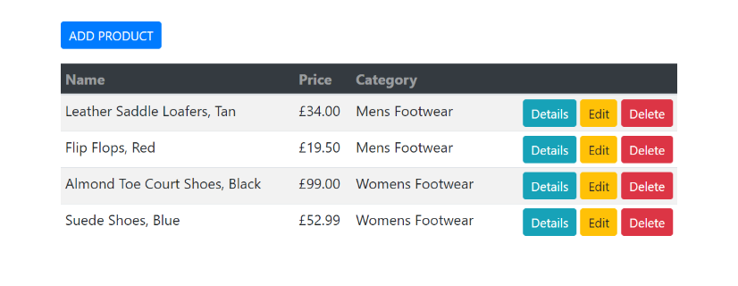

# Dotnet Core Crud Application
This repository contains a dotnet core application that allows to:
- Perform CRUD opperations on a list of products using EntityFrameworkCore and Repository Pattern.
- Demonstrate how a project can be organized in an N-Tier architecture for increased maintainability and scalability.
- Use best practices to preserve the modular nature of Razor Pages without duplicating code and html markup.

## ProjectStructure

### __ProductCrudRP.Core__   - The middle tier
This class library contains the domain models and repository interfaces which will be injected into the services of the presentation layer. 
### __ProductCrudRP.DataAccess__   - The data tier
This class library contains the database context and the implememntations of the repository interfaces defined in the middle layer.
### __ProductCrudRP.Web__   - The presentation tier
RazorPages application that configures EntityFramework to use Sqlite with an in memory database.

##Images

